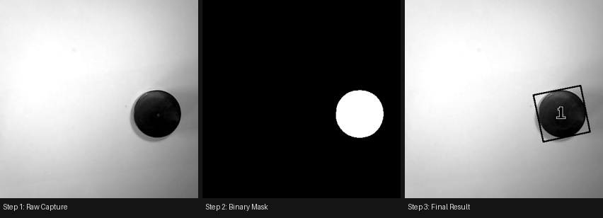

# ESP32-CAM Object Measurement System

A **fully on-board** real-time object measurement system built on the ESP32-CAM.
No PC, no cloud, no external processor — the ESP32 captures, processes, and measures entirely by itself, saving annotated results directly to a MicroSD card. Controlled through a simple Serial command interface.


---

## On-Board Processing — No External Hardware Needed

Every stage of the vision pipeline runs **entirely on the ESP32-CAM chip itself**:

| Stage | Runs on |
|-------|---------|
| Image capture | OV2640 camera → ESP32 frame buffer |
| Adaptive thresholding | ESP32 CPU |
| Morphological cleanup | ESP32 CPU |
| Blob detection (flood fill) | ESP32 PSRAM |
| PCA oriented bounding box | ESP32 CPU |
| Result annotation + drawing | ESP32 CPU |
| File storage | MicroSD card via SDMMC |

The only connection needed during normal operation is **5V power**.
Serial is used only to send commands and read results — a phone charger and any USB-Serial adapter is sufficient.

---

## Pipeline Walkthrough — Real Measurement Example

The images below are **actual output files** saved to the SD card during a test run on a circular object placed on a white surface.



---

### Step 1 — Raw and Crop Capture


The ESP32-CAM captures a full grayscale frame and applies a **420×420 centre crop** to isolate the measurement area and remove lens-distorted edges. The frame is captured with **locked exposure** (set during calibration) so brightness is identical to the background reference.

The object — a circular puck — is clearly darker than the white surface. Slight vignetting (brightness gradient) is visible across the frame. This is handled by the 4×4 adaptive calibration grid rather than a single flat threshold.

---

### Step 2 — Binary Threshold + Morphology 


The adaptive threshold computes a separate threshold for each cell in a **4×4 grid** using:

```
threshold = cell_mean - k * cell_stddev   (default k = 2.5)
```

Thresholds are **bilinearly interpolated** between cells so there are no hard zone edges. After thresholding, three morphological passes clean the mask:

1. **Fill holes** — closes internal gaps in the object
2. **Erode** — removes noise from the object boundary
3. **Dilate** — restores the object to its true size

The result is a clean solid-white blob on a pure-black background. The adaptive calibration has correctly compensated for the uneven illumination across the frame.

---

### Step 3 — Measurement Result 


A **PCA-based oriented bounding box** is fitted to the detected blob. PCA (Principal Component Analysis) finds the true length axis of the object — not the screen-axis bounding box — so the measurement is correct even if the object is rotated at any angle.

The annotated image shows:
- **Black oriented bounding box** aligned to the object's principal axis
- **Object number label** rendered in a bold bitmap font at the centroid
- **Centre cross (×)** at the image centre marking the optical axis

Dimensions are printed to Serial:
```
Object 1: L=38.52 mm  W=37.41 mm
```

---

## Features

- **Fully on-board** — zero external processing hardware needed
- **Adaptive background calibration** — 4×4 grid, per-cell mean + stddev, bilinear interpolation between zones
- **PCA oriented bounding box** — rotation-invariant true length and width measurement
- **Exposure locking** — AEC/AGC locked after calibration for consistent brightness across captures
- **OV2640 LENC artefact suppression** — direct hardware register writes remove the lens-shading correction rectangle
- **Morphological pipeline** — fill holes → erode → dilate → remove small blobs (correct order matters)
- **Contrast stretching** — optional per-image histogram normalisation before thresholding
- **Centre crop** — configurable square crop to focus on the measurement zone
- **PGM file output** — raw, binary, and annotated result images saved to SD card for review
- **Batch capture** — type a number (e.g. `5`) to capture N images automatically
- **Full Serial command interface** — tune every parameter at runtime, no reflashing needed

---

## Hardware Requirements

| Component | Details |
|-----------|---------|
| Board | ESP32-CAM (AI Thinker recommended) |
| Camera | OV2640 (included on ESP32-CAM) |
| Storage | MicroSD card (FAT32 formatted) |
| Power | 5V / 2A supply (camera draws ~300 mA peak) |
| Programmer | FTDI USB-to-Serial adapter or ESP32-CAM-MB programmer board |

> **PSRAM required** for resolutions above SVGA. The AI Thinker ESP32-CAM includes 4 MB PSRAM.

---

## File Structure

```
ESP32MEASUR/
├── ESP32MEASUR.ino   Main sketch: globals, setup(), loop(), calibration, commands
├── vision.cpp        Full vision pipeline: threshold, morphology, blobs, drawing
├── vision.h          Vision API declarations
├── config.h          extern declarations for all global variables
├── board_config.h    Camera model selection
└── camera_pins.h     GPIO pin map for all supported boards

images/
├── pipeline_demo.png
├── step1_cropped.png
├── step2_binary.png
└── step3_final.png
```

---

## Getting Started

### 1. Install Arduino IDE and ESP32 Board Support

1. Download [Arduino IDE 2.x](https://www.arduino.cc/en/software)
2. Open **File → Preferences** and add this URL to *Additional boards manager URLs*:
   ```
   https://raw.githubusercontent.com/espressif/arduino-esp32/gh-pages/package_esp32_index.json
   ```
3. Open **Tools → Board → Boards Manager**, search `esp32`, install **esp32 by Espressif Systems**

### 2. Select Your Board

Uncomment your board in `board_config.h`:

```cpp
#define CAMERA_MODEL_AI_THINKER   // most common ESP32-CAM
// #define CAMERA_MODEL_M5STACK_WIDE
// #define CAMERA_MODEL_ESP32S3_EYE
```

### 3. Arduino IDE Settings

| Setting | Value |
|---------|-------|
| Board | AI Thinker ESP32-CAM |
| Partition Scheme | **Huge APP (3MB No OTA)** |
| CPU Frequency | 240 MHz |
| Flash Size | 4MB |
| Upload Speed | 115200 |

> The partition scheme must have at least 3MB APP space or the sketch will not fit.

### 4. Upload Wiring (FTDI adapter)

```
ESP32-CAM   FTDI
─────────   ────
GND      →  GND
5V       →  VCC (5V)
U0R      →  TX
U0T      →  RX
IO0      →  GND   ← only during upload, remove after
```

Press **RST** on the ESP32-CAM after connecting IO0 to GND, before each upload.

### 5. Open Serial Monitor

- Baud rate: **115200**
- Line ending: **Newline** or **Both NL & CR**

---

## First Use Workflow

```
1.  Power on → system prints status + command menu

2.  Set mm/pixel scale (use a known-size reference object):
    MM 0.36

3.  Point camera at clean white background, remove all objects:
    CALIBRATE

4.  Place object under camera:
    CAPTURE

5.  Read measurement from Serial:
    Object 1: L=38.52 mm  W=37.41 mm

6.  Check SD card for saved images:
    original_000.pgm  raw cropped frame
    binary_000.pgm    thresholded mask
    final_000.pgm     annotated result
```

---

## Serial Commands

| Command | Description | Example |
|---------|-------------|---------|
| `CALIBRATE` | Capture empty background and calibrate | `CALIBRATE` |
| `CAPTURE` | Measure objects in frame | `CAPTURE` |
| `STATUS` / `HELP` | Show all settings and commands | `STATUS` |
| `MM <val>` | Set millimetres per pixel | `MM 0.36` |
| `CROP <size>` | Enable centre square crop | `CROP 420` |
| `CROP OFF` | Disable crop, use full frame | `CROP OFF` |
| `RES <0-13>` | Change capture resolution | `RES 8` |
| `KSIGMA <val>` | Detection sensitivity (lower = more sensitive) | `KSIGMA 2.0` |
| `MINAREA <px>` | Minimum blob area to count as object | `MINAREA 100` |
| `MAXAREA <px>` | Maximum blob area | `MAXAREA 50000` |
| `CONTRAST <0/1>` | Enable/disable contrast stretch | `CONTRAST 1` |
| `STRENGTH <0-100>` | Contrast stretch strength | `STRENGTH 25` |
| `OFFSET <val>` | Fallback threshold offset (uncalibrated mode) | `OFFSET 20` |
| `UNLOCKEXP` | Re-enable auto-exposure (then recalibrate) | `UNLOCKEXP` |
| `DIAGNOSE` | Print pixel histogram without measuring | `DIAGNOSE` |
| `<number>` | Batch capture N images | `5` |

---

## Default Configuration

| Parameter | Default | Description |
|-----------|---------|-------------|
| Resolution | VGA 640×480 | Capture resolution |
| Crop | ON — 420×420 px | Centre square crop |
| Scale | 0.36 mm/px | Physical scale |
| Min blob area | 300 px | Smallest detectable object |
| Max blob area | 35 000 px | Largest detectable object |
| K-sigma | 2.5 | Threshold = mean − 2.5 × stddev |
| Contrast | ON — strength 25 | Contrast stretch |
| Units | mm | Output measurement units |

---

## Tuning Guide

**Object not detected**
- Run `DIAGNOSE` — prints histogram and foreground pixel count
- 0 foreground pixels → lower `KSIGMA` (try `KSIGMA 1.5`) or `CALIBRATE` again
- Object must be **darker** than background

**Too many false detections**
- Raise `KSIGMA` (try `KSIGMA 3.0`)
- Raise `MINAREA` to filter noise blobs

**Inaccurate measurements**
- Recalibrate `MM` using a known-size reference
- Recalibrate after any change to lighting or camera height
- Use `CROP` to avoid lens edge distortion

---

## Output Files on SD Card

Saved as **PGM (Portable Graymap)** — viewable in [IrfanView](https://www.irfanview.com/), [GIMP](https://www.gimp.org/), or Python (`PIL.Image.open("file.pgm")`).

| File | Contents |
|------|----------|
| `original_NNN.pgm` | Raw captured (cropped) frame |
| `binary_NNN.pgm` | After thresholding and morphology |
| `final_NNN.pgm` | Annotated result with bounding boxes |

---

## Supported Boards

- AI Thinker ESP32-CAM ✅ (tested)
- M5Stack ESP32-CAM
- M5Stack Wide
- ESP32-S3 Eye
- WROVER Kit
- XIAO ESP32-S3

---

## License

MIT License — free to use, modify, and distribute.
